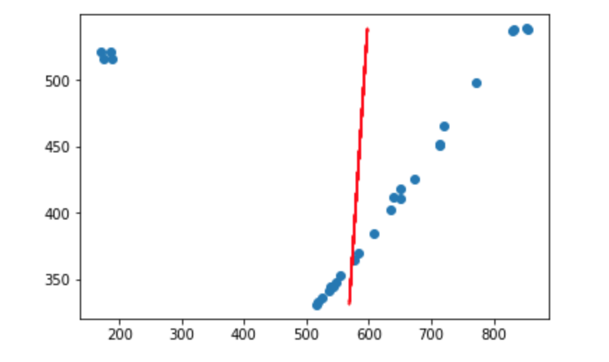
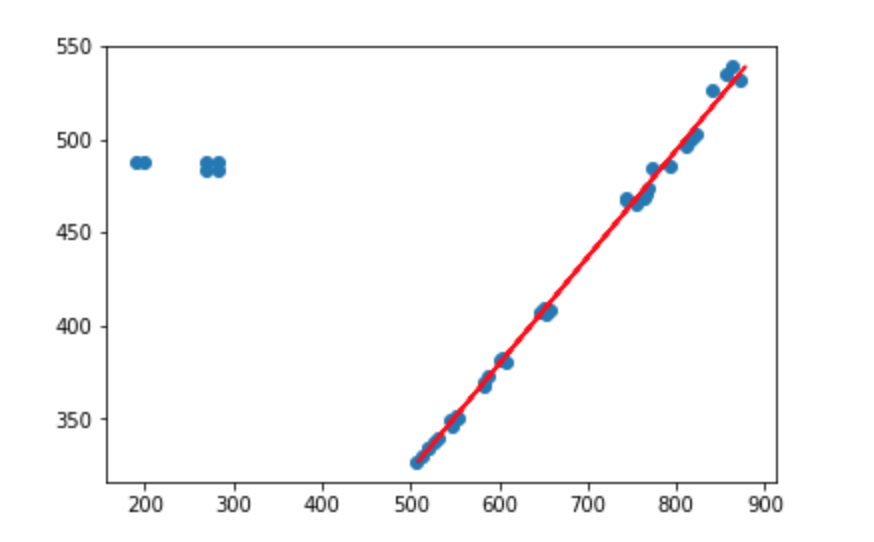
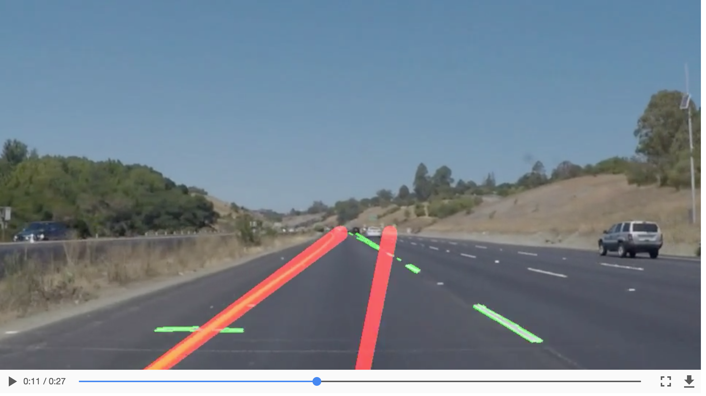

# **Finding Lane Lines on the Road** 

## Xianlei Qiu

---

The goals / steps of this project are the following:

* Make a pipeline that finds lane lines on the road
* Reflect on your work in a written report

---

### Reflection

### 1. Describe your pipeline. As part of the description, explain how you modified the draw_lines() function.

The pipeline of the lanes detector can be described as below:

* Read image.
* Apply grayscale to the image.
* Apply Gaussian bulr to filter out high frequency noise.
* Apply Canny algorithm to get all edges.
* Draw an interested region mask and apply the mask to the detected edges.
* Use Hough Lines function to get all possible lines.
* Average lines using `draw_lines` function.
* Draw averaged left line and right line on the original image. 

The main logic in the `draw_lines` function is dividing all the lines to left and right line 
according to their **slope** or `tan` value. If `tan(line) > 0`, the line will be 
classified as right line. Otherwise, we treat it as left line. Once we get all the points in
left line and right line, `np.polyfit` will be used to fit a one-dgree line. 

Several optimizations were made to improve the accuracy and stability of the `draw_lines` function.
Firstly, we can saw some outliers while we tried to fit the potins.

  
   
  <em>Figure 1: How outliers affect line fitting</em>

The outliers will result in fitting a line which will severely diverge from the true line.

  
   
  <em>Figure 2: How outliers affect line detection</em>

So, before fitting, we will need to filter out outliers. This graph shows the line fitted to points without outliers.

  
   
  <em>Figure 3: Line fitting after filtering out outliers</em>

  
Besides, horizontal line will also affect our detector. Therefore, we also need filter out lines whose slope are close the horizontal line. 

  
   
  <em>Figure 4: How horizontal lines affect line detection</em>

### 2. Identify potential shortcomings with your current pipeline

My current lines detector has several flaws: 

* It can only detect straight lines.
* It has a strong assumption that there will be only **two** lines, left and right.
* It has a large constraint that it only detect lines in interested region. And there should not be any other cars in the intereted region.
* Senstive to the other random edges in the interested region. If there are some othere edges, like those in optional challenge video, the detector cannot work properly.

### 3. Suggest possible improvements to your pipeline

I feel like the current lines detector has too many constraints and assumptions, which make it impractical to apply in real world. One possible improvement is to continue tune the parameters in **Canny** and **Hough** functions. Another improvement may be to adopt more intelligent algorithms, like deep learning.

